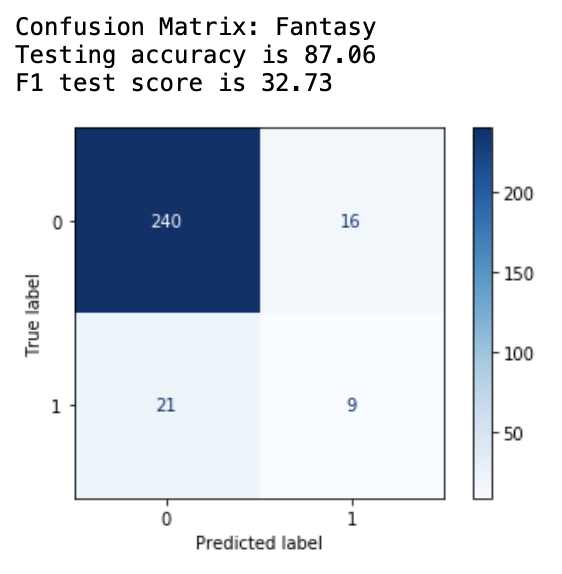

 
  
# Genre Detection Using Film Scripts :movie_camera: 

  

### Prerequisites
This project was completed using a ml.t2.xlarge notebook instance on [Amazon SageMaker on Amazon Web Services(AWS)](https://aws.amazon.com/sagemaker/?nc2=h_ql_prod_ml_sm).

## Introduction
Genres are used to categorize art based on a certain set of criteria.1 They are an agreement between the creator and the audience of what to expect of the film. The genre helps set the tone for the film which in some ways acts as a guideline for the screenwriter. It is then used to help draw audiences in. The film industry is constantly looking for new ways to draw in an audience and establishing the genre is one of the primary ways of doing so.

The motivation for this project comes from my personal interest in films and exploring ways for them to streamline their marketing processes. Using the script to detect the genre of the film will let the screenwriter and film studios know whether or not they are portraying the tone that they intended to portray. This will also serve to help film studios be better able to identify the genres of their movies and be able to do it in an automated and standardized way. This type of classifier can be used to inform and enhance film recommendation systems by being able to create labels/tags instantly. This also helps better inform the viewers of the type of movie they are about to see.

## Dataset
Scripts were scrapped from the [The Internet Movie Script Database](https://imsdb.com)
- **Total Number of Scripts:** 1,1416
- **Total Number of Genres:** 22

## Data Cleaning
Data Cleaning Process:
- Removed punctuation
- Removed all numbers
- Removed all capital words - these were the scene directions and other words that were not a part of the dialogue
- Standardized case (all lower case)
- Removed stop words 
- Tokenized words 
- Lemmatized words (nltk + POS tagging)

### LDA
Here is a display of LDA topic modeling which utilizes count vectorizer to find the frequency for each word within and between texts. The image below is not ideal. Ideally, each circle representing a topic would be nicely spread apart and would not overlap.

## Modeling
### One vs. Rest Classifier:
   - Logistic Regression
   - Linear Support Vector Classifier
   - Multinomial Naive Bayes
   
Although all classifiers struggled to classify the minority class, the Multinomial Naive Bayes Classifier performed the best across the board for all genre labels.

### Recurrent Neural Network:
   - Long Term Short Term Memory Cells (LSTM)
   - Gated Redcurrent Units (GRU)

## Author
[Sandra Welbeck](https://github.com/SWelbeck)  

## Sources
1. [The Internet Movie Script Database](https://imsdb.com)  
2. [Wikipedia: Genre](https://en.wikipedia.org/wiki/Genre) <b>

## Repository Contents
- `Notebooks` folder: A folder for the python scripts that your Jupyter Notebook imports
  - `Neural_Nets.ipynb`: Code for Recurrent Neural Networks
  - `Scrapy_Webscrape.ipynb`: Code to web scrape data from imsdb.com
  - `Script_EDA.ipynb`: Code containing EDA and modeling process
- `images`: A folder containing images you see in this readme
- `.gitignore`: A hidden file that tells git to not track certain files and folders
- `README.md`: The README for this repo branch explaining it's contents - you're reading it now
